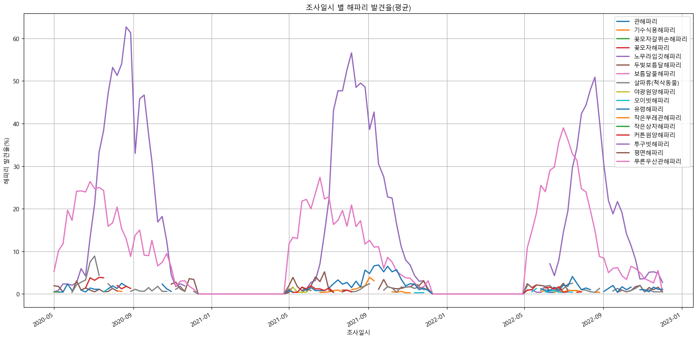
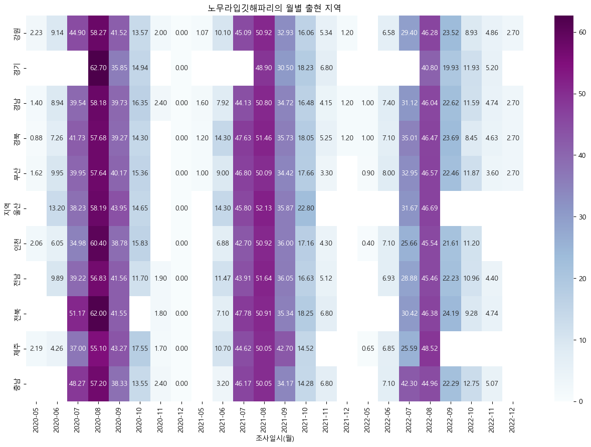
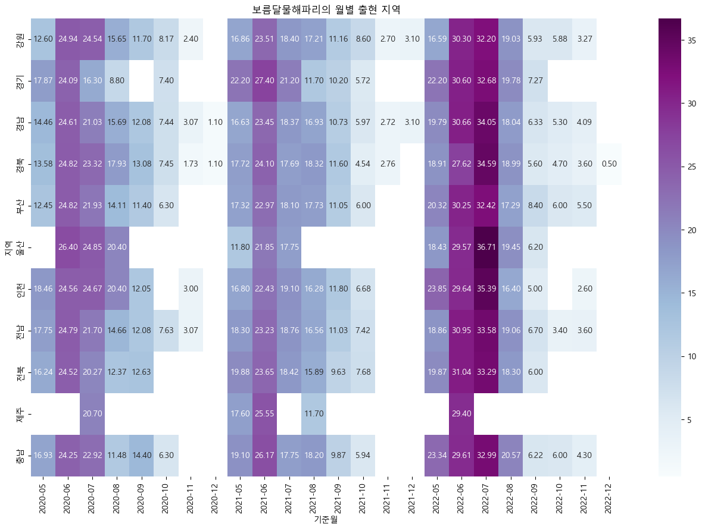

# 해양정보 데이터 통합 및 분석 

 

## 1. 프로젝트 목적
- **팀 목표** : 해양 안전사고를 방지하기 위해 안전과 밀접한 해양 정보 수집
- **개인 목표** : 필요 데이터 추출을 위한 각종 전처리 기술 사용

 

## 2. 프로젝트 기간 및 참여인원
📅 2023.06.08~2023.06.19 (**12일**) / 👥 5명

 

## 3. 담당 역할
- 정규표현식과 딕셔너리를 활용하여 문서형 비정형 데이터 전처리 [🔗](files/해파리_데이터_전처리.ipynb)
  
- 해파리 데이터 EDA 진행
  
  - 해파리 모니터링을 6월~9월에만 진행하여 12월\~5월 데이터는 부재
  - 해수욕장 개장 시기와 유사하기에 해수욕장 안전사고 예방 자료로 활용 가능
     
  

     &nbsp;&nbsp;&nbsp;&nbsp;&nbsp;&nbsp;&nbsp;&nbsp;
    
  

  - 발견율 최상위인 해파리는 강독성인 노무라입깃해파리이며, 노무라 입깃해파리는 매년 8월에 가장 많이 발견되며, 3년 간의 발견 추이(57.9%→51.0%→46.2%)는 감소하고 있음
  - 발견율 차상위인 약독성인 보름달물해파리이며, 보름달물해파리는 매년 6-7월에 가장 많이 발견되며, 3년 간의 발견 추이(23.4% → 21.3% → 31.9%)는 증가하고 있음

 
  
### 4. 교훈
- 데이터 활용하기에 앞서, 어떤 데이터를 수집하고 어떻게 사용할지에 대한 충분한 상호논의가 필요
- 필요 데이터를 추출하기 위해 딕셔너리, 정규표현식을 활용하면 효율적임
